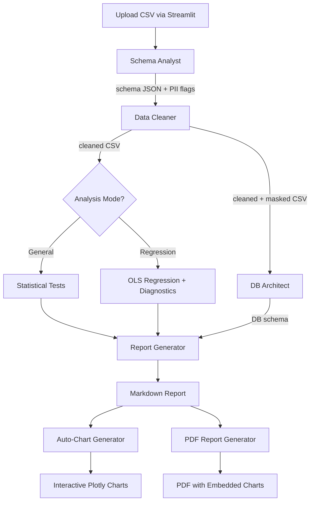

# Stat Engine Agent

## Overview

Stat Engine Agent is a multi-agent AI pipeline that analyzes CSV files
automatically. Five specialized AI agents work in sequence, each handling a
phase of the analysis. The agents use Google Gemini 2.0 Flash as the LLM and
communicate through CrewAI, passing structured results from one step to the
next.

**Key Features:**
- 🔒 **PII Detection & Masking** -- auto-detects sensitive data (emails, phones, SSNs) and redacts it before sending to LLM agents
- 🔬 **Dual Analysis Modes** -- toggle between General statistical analysis and focused Linear Regression (OLS) with full diagnostics
- 📄 **PDF Reports** -- downloadable PDF with embedded charts, Unicode symbols (β, R², α), and professional styling
- 📊 **Interactive Plotly Charts** -- auto-generated from statistical findings, mode-aware (9 regression-specific chart types)
- 🗄️ **MySQL Integration** -- deterministic database naming with clean overwrite on re-runs

---

## Architecture

```
CSV Upload -> Schema Analyst -> Data Cleaner -> DB Architect -> Statistical Analyst -> Report Generator -> Report + Charts + PDF
                  |                  |
              PII Detection      PII Masking
```

Each agent has a custom Python tool that executes the computation. The agent
decides what to do (based on the data); the tool does the work.

After the AI pipeline completes, a separate stats-driven chart generator runs
actual statistical tests on the cleaned data and produces interactive Plotly
charts for every significant finding.

---

## Project Structure

```
Stat_Engine_Agent/
    main.py                         # Streamlit frontend (with regression toggle)
    requirements.txt                # Python dependencies
    .env                            # API keys and config (gitignored)
    .env.example                    # Template for .env
    src/
        __init__.py
        crew.py                     # CrewAI pipeline orchestration (mode-aware)
        config/
            settings.py             # Centralized settings (Pydantic) + analysis_mode
            agents.yaml             # Agent role definitions (PII-aware)
            tasks.yaml              # Task descriptions (general + regression)
        tools/
            csv_reader.py           # Schema analysis tool (PII detection)
            data_cleaner.py         # Data cleaning tool (PII masking)
            mysql_loader.py         # Database loading tool
            statistical_tests.py    # General statistical testing tool
            regression_analysis.py  # OLS regression tool (VIF, ACF, diagnostics)
            chart_generator.py      # Agent-callable chart tool (backup)
        utils/
            auto_charts.py          # Stats-driven chart generator (general + regression)
            data_masker.py          # PII detection and masking utilities
            pdf_report.py           # PDF report generator with Unicode support
            db.py                   # Database connection utilities (DROP+CREATE)
            security.py             # File validation and sanitization (deterministic DB names)
        models/
            state.py                # Pydantic data models (with regression/PII fields)
    documentation/
        agents_and_workflow.md      # Detailed technical documentation
    datasets/                       # Sample CSV datasets
    uploads/                        # Temporary upload storage (auto-cleaned)
    outputs/                        # Per-CSV analysis results
        {csv_name}/
            report.md               # Generated markdown report
            report.pdf              # Generated PDF with embedded charts
            charts/                 # PNG chart exports
```

---

## Analysis Modes

### General Mode (Default)

Standard statistical analysis including:
- Shapiro-Wilk / D'Agostino normality tests
- Pearson / Spearman correlations
- Independent t-test / Mann-Whitney U (2-group comparisons)
- ANOVA / Kruskal-Wallis (3+ group comparisons)
- Chi-squared tests for categorical associations
- Descriptive statistics

### Linear Regression Mode (Toggle)

Focused OLS regression analysis that answers **9 structured questions**:

1. **Dataset Description** -- observations, variables, types, domain
2. **Dependent Variable Selection** -- justified choice with reasoning
3. **Independent Variable Selection** -- predictors with domain rationale
4. **Relationship Exploration** -- summary statistics and correlations
5. **Model Specification** -- equation Y = β₀ + β₁X₁ + ... + ε
6. **Coefficient Interpretation** -- each coefficient in plain language
7. **Model Fit** -- R², Adjusted R², F-statistic, AIC, BIC
8. **Residual Analysis**:
   - a) Residuals vs Fitted values
   - b) Random distribution around zero
   - c) Heteroscedasticity (Breusch-Pagan test)
   - d) Normality (QQ plot, Jarque-Bera, histogram)
   - e) Autocorrelation (Durbin-Watson, ACF/PACF)
   - f) Multicollinearity (VIF scores)
9. **Model Assessment** -- appropriateness and improvement recommendations

#### Regression-Specific Charts

| Chart | Purpose |
|-------|---------|
| Actual vs Predicted | Model fit visualization |
| Residuals vs Fitted | Pattern detection |
| QQ Plot of Residuals | Normality assessment |
| Residual Distribution | Histogram shape |
| ACF Plot | Autocorrelation at each lag |
| PACF Plot | Partial autocorrelation |
| VIF Bar Chart | Multicollinearity severity |
| Coefficient Plot | Effect sizes with CIs |
| Correlation Matrix | Predictor relationships |

---

## Agents

### 1. Schema Analyst

**Role:** Data Schema Expert
**Tool:** CSVReaderTool (src/tools/csv_reader.py)

- Auto-detects file encoding (UTF-8, Latin-1, etc.)
- Identifies column data types: numeric, categorical, datetime, boolean
- Counts nulls, unique values, and provides sample data
- **Detects PII columns** (email, phone, SSN, credit card, names, IP addresses)
- **Redacts PII sample values** before passing to LLM agents
- Detects the data domain (finance, healthcare, survey, etc.)

### 2. Data Cleaner

**Role:** Data Quality Engineer
**Tool:** DataCleanerTool (src/tools/data_cleaner.py)

- Nulls: median (numeric), mode (categorical), drop if >50% null
- Duplicate row removal
- Data type fixes, outlier removal (IQR method)
- **Auto-detects and masks PII** after cleaning
- **Saves both**: `cleaned_*.csv` (full) and `masked_cleaned_*.csv` (PII-redacted)
- PII masking uses deterministic SHA-256 hashing for consistency

### 3. DB Architect

**Role:** Database Architect
**Tool:** MySQLSchemaDesignerTool (src/tools/mysql_loader.py)

- **Deterministic database naming** (MD5 hash of filename, not random UUID)
- **DROP + CREATE** on re-runs for clean overwrite (no duplicate databases)
- Designs normalized relational schema when appropriate
- Loads data in chunked inserts (1000 rows per batch)

### 4. Statistical Analyst

**Role:** Senior Statistician
**Tools:**
- General mode: StatisticalTestTool (src/tools/statistical_tests.py)
- Regression mode: RegressionAnalysisTool (src/tools/regression_analysis.py)

General mode test selection:

| Scenario                | Normal Data         | Non-Normal Data   |
|-------------------------|---------------------|-------------------|
| 2-group comparison      | Independent t-test  | Mann-Whitney U    |
| 3+ group comparison     | One-way ANOVA       | Kruskal-Wallis    |
| Correlation             | Pearson             | Spearman          |
| Categorical association | Chi-squared         | Chi-squared       |

Regression mode diagnostics: OLS fit, VIF, Durbin-Watson, Jarque-Bera,
Breusch-Pagan, ACF/PACF, coefficient analysis with confidence intervals.

### 5. Report Generator

**Role:** Research Report Writer
**Tool:** ChartGeneratorTool (src/tools/chart_generator.py)

- General mode: standard sections (Executive Summary through Conclusions)
- Regression mode: structured Q&A format answering all 9 regression questions
- Report saved as both Markdown and PDF

---

## PII Detection & Masking

The pipeline automatically detects and protects sensitive data:

**Detection Methods:**
- Regex patterns: email, phone, SSN, credit card, IP address
- Column name heuristics: "name", "email", "phone", "address", "ssn", etc.

**Masking Strategies:**
- Email: `j***@***.com`
- Phone: `***-***-1234`
- SSN/Credit Card: `***-**-5678`
- Names: deterministic SHA-256 hash
- General: full redaction

PII is never sent to the LLM agents in raw form. Schema Analyst sees
`[REDACTED]` for PII samples. Data Cleaner saves a masked version alongside
the full cleaned data.

---

## PDF Report Generation

Reports are exported as professional PDFs with:
- **Unicode font auto-discovery** (Calibri, Arial, Segoe UI, DejaVu Sans)
- Proper rendering of β, R², α, σ, ≤, ≥, ± and all Greek/math symbols
- Styled cover page with accent stripe
- Section headers with blue background bands
- Embedded chart PNGs
- ASCII fallback if no Unicode font is found
- Generated via fpdf2 library

---

## Stats-Driven Chart System

### General Mode Charts

| Finding                          | Chart Type                               |
|----------------------------------|------------------------------------------|
| Significant correlation (r > 0.3)| Scatter plot with trendline, r and p     |
| Significant group difference     | Violin + box plot with test name and p   |
| Categorical association          | Stacked bar with chi-squared and V       |
| Distribution shapes              | Overlaid histograms (Normal/Non-Normal)  |
| Non-normal column                | QQ plot with normality p-value           |
| All pairwise correlations        | Correlation heatmap                      |
| Primary category                 | Donut chart with proportions             |
| Multiple group metrics           | Radar chart (normalized)                 |
| Hierarchical categories          | Sunburst chart                           |

### Reproducibility

A fixed random seed (RANDOM_SEED = 42) is set in main.py and auto_charts.py.
Same data produces identical results every time.

---

## Output Structure

```
outputs/
    hdi_data/
        report.md                   # Markdown report
        report.pdf                  # PDF with embedded charts
        charts/
            1_Actual_vs_Predicted.png
            2_Residuals_vs_Fitted.png
            3_QQ_Plot_Residuals.png
            ...
```

Previous uploads are automatically cleaned before and after each run.

---

## Workflow Diagram



---

## Error Handling and Retry Logic

The pipeline includes automatic retry with exponential backoff for API
quota errors:

- Maximum retries: 5
- Delay schedule: 60s, 120s, 240s, 480s, 960s
- Detects quota errors across the full exception chain
- Extracts API-suggested retry delays when available
- Displays retry status in the Streamlit UI

---

## Security

- **File validation:** only .csv files accepted, MIME type checked, size limited
- **Filename sanitization:** UUID-prefixed to prevent path traversal
- **PII protection:** auto-detected and masked before LLM exposure
- **SQL injection prevention:** all queries use SQLAlchemy parameterized statements
- **API key protection:** stored in .env (gitignored), loaded via Pydantic settings
- **Database isolation:** each CSV gets its own database (deterministic naming)

---

## Configuration

All settings are in .env (copy from .env.example):

```
GEMINI_API_KEY=your_key_here
MYSQL_HOST=localhost
MYSQL_PORT=3306
MYSQL_USER=root
MYSQL_PASSWORD=your_password_here
MAX_UPLOAD_SIZE_MB=50
```

Settings are loaded via Pydantic BaseSettings (src/config/settings.py) with
validation, type safety, and environment variable binding.

---

## Running the App

```powershell
cd D:\ai-ml-base\Projects\Stat_Engine_Agent
.\venv\Scripts\activate
streamlit run main.py
```

Open http://localhost:8501 in your browser, upload a CSV, and click Run Analysis.
Toggle the 🔬 Linear Regression Mode switch in the sidebar for regression-focused analysis.

---

## Dependencies

| Package              | Purpose                              |
|----------------------|--------------------------------------|
| crewai[google-genai] | Multi-agent framework + Gemini LLM   |
| crewai-tools         | CrewAI tool decorators               |
| streamlit            | Web frontend                         |
| pandas               | Data manipulation                    |
| numpy                | Numerical operations                 |
| scipy                | Statistical tests                    |
| plotly               | Interactive chart generation         |
| kaleido              | Plotly PNG export engine             |
| sqlalchemy           | Database ORM                         |
| pymysql              | MySQL connector                      |
| chardet              | File encoding detection              |
| python-dotenv        | .env file loading                    |
| pydantic-settings    | Type-safe configuration              |
| statsmodels          | OLS regression, VIF, ACF/PACF        |
| fpdf2                | PDF report generation with Unicode   |
