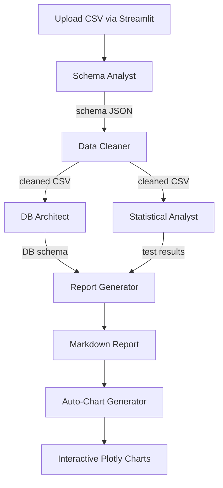

# Stat Engine Agent

## Overview

Stat Engine Agent is a multi-agent AI pipeline that analyzes CSV files
automatically. Five specialized AI agents work in sequence, each handling a
phase of the analysis. The agents use Google Gemini 2.0 Flash as the LLM and
communicate through CrewAI, passing structured results from one step to the
next. Charts are generated independently using statistical test results, not
through the AI agents, ensuring accuracy and reproducibility.

---

## Architecture

```
CSV Upload -> Schema Analyst -> Data Cleaner -> DB Architect -> Statistical Analyst -> Report Generator -> Report + Interactive Charts
```

Each agent has a custom Python tool that executes the computation. The agent
decides what to do (based on the data); the tool does the work.

After the AI pipeline completes, a separate stats-driven chart generator runs
actual statistical tests on the cleaned data and produces interactive Plotly
charts for every significant finding.

---

## Project Structure

```
Stat_Engine_Agent/
    main.py                         # Streamlit frontend
    requirements.txt                # Python dependencies
    .env                            # API keys and config (gitignored)
    .env.example                    # Template for .env
    src/
        __init__.py
        crew.py                     # CrewAI pipeline orchestration
        config/
            settings.py             # Centralized settings (Pydantic)
            agents.yaml             # Agent role definitions
            tasks.yaml              # Task descriptions
        tools/
            csv_reader.py           # Schema analysis tool
            data_cleaner.py         # Data cleaning tool
            mysql_loader.py         # Database loading tool
            statistical_tests.py    # Statistical testing tool
            chart_generator.py      # Agent-callable chart tool (backup)
        utils/
            auto_charts.py          # Stats-driven chart generator (primary)
            db.py                   # Database connection utilities
            security.py             # File validation and sanitization
        models/
            state.py                # Pydantic data models
    documentation/
        agents_and_workflow.md      # This file
    datasets/                       # Sample CSV datasets
    uploads/                        # Temporary upload storage (auto-cleaned)
    outputs/                        # Per-CSV analysis results
        {csv_name}/
            report.md               # Generated report
            charts/                 # PNG chart exports
```

---

## Agents

### 1. Schema Analyst

**Role:** Data Schema Expert
**Tool:** CSVReaderTool (src/tools/csv_reader.py)

Reads the uploaded CSV and produces a schema report:
- Auto-detects file encoding (UTF-8, Latin-1, etc.)
- Identifies column data types: numeric, categorical, datetime, boolean
- Counts nulls, unique values, and provides sample data
- Detects the data domain (finance, healthcare, survey, etc.)
- Flags issues: high null rates, suspicious cardinality, mixed types

### 2. Data Cleaner

**Role:** Data Quality Engineer
**Tool:** DataCleanerTool (src/tools/data_cleaner.py)

Cleans the data based on schema analysis:
- Numeric nulls filled with median (robust to outliers)
- Categorical nulls filled with mode (most common value)
- Rows with >50% null values dropped
- Duplicate rows removed
- Data types fixed (e.g., prices as strings converted to float)
- Outliers removed using IQR method (1.5x interquartile range)
- All-null columns dropped
- Saves cleaned data to uploads/cleaned_{filename}.csv

Edge cases handled: zero IQR (constant columns) skips outlier removal,
empty DataFrame after cleaning is logged as warning.

### 3. DB Architect

**Role:** Database Architect
**Tool:** MySQLSchemaDesignerTool (src/tools/mysql_loader.py)

Designs and loads a MySQL database:
- Creates a dedicated database per CSV (e.g., csv_sales_data_a1b2c3)
- Designs normalized relational schema when appropriate
- Falls back to single-table if data is already well-structured
- Loads data in chunked inserts (1000 rows per batch)
- Sanitizes all column and table names for MySQL

Edge cases handled: special characters in names, duplicate column names
after sanitization, empty DataFrames blocked, engine cleanup on failure.

### 4. Statistical Analyst

**Role:** Senior Statistician
**Tool:** StatisticalTestTool (src/tools/statistical_tests.py)

Runs appropriate tests based on data characteristics:

| Scenario                | Normal Data         | Non-Normal Data   |
|-------------------------|---------------------|-------------------|
| 2-group comparison      | Independent t-test  | Mann-Whitney U    |
| 3+ group comparison     | One-way ANOVA       | Kruskal-Wallis    |
| Correlation             | Pearson             | Spearman          |
| Categorical association | Chi-squared         | Chi-squared       |

- Shapiro-Wilk normality test (n < 5000) or D'Agostino-Pearson (larger)
- Descriptive stats: mean, median, std, skewness, kurtosis
- Results interpreted in plain language with p-values

Edge cases handled: constant columns filtered out, too few values
(<8 for normality, <3 per group) skip tests, NaN/Inf replaced,
high-cardinality categoricals (>50 unique) excluded.

### 5. Report Generator

**Role:** Research Report Writer
**Tool:** ChartGeneratorTool (src/tools/chart_generator.py)

Compiles all prior agent results into a Markdown report:
1. Executive Summary
2. Data Overview
3. Data Cleaning Summary
4. Database Schema
5. Statistical Analysis (test results with p-values)
6. Conclusions and Recommendations

Report saved to: outputs/{csv_name}/report.md

---

## Stats-Driven Chart System

Charts are NOT generated by the AI agents. Instead, after the pipeline
completes, a dedicated chart generator (src/utils/auto_charts.py) runs
actual statistical tests on the cleaned data and creates Plotly charts for
every significant finding (p < 0.05).

### Statistical Tests Run

1. **Normality** -- Shapiro-Wilk or D'Agostino-Pearson on each numeric column
2. **Correlations** -- Pearson correlation for every numeric pair
3. **Group comparisons** -- Mann-Whitney U (2 groups) or Kruskal-Wallis (3+)
4. **Categorical associations** -- Chi-squared with Cramer's V effect size

### Charts Generated

| Finding                          | Chart Type                               |
|----------------------------------|------------------------------------------|
| Significant correlation (r > 0.3)| Scatter plot with trendline, r and p     |
| Significant group difference     | Violin + box plot with test name and p   |
| Categorical association          | Stacked bar with chi-squared and V       |
| Distribution shapes              | Overlaid histograms (Normal/Non-Normal)  |
| Non-normal column                | QQ plot with normality p-value           |
| All pairwise correlations        | Correlation heatmap                      |
| Primary category                 | Donut chart with proportions             |
| Multiple group metrics           | Radar chart (normalized)                 |
| Hierarchical categories          | Sunburst chart                           |

Every chart title includes the test name, statistic, and p-value. Charts
display interactively in the Streamlit UI using st.plotly_chart(). PNG
copies are saved to outputs/{csv_name}/charts/ for offline reference.

### Reproducibility

A fixed random seed (RANDOM_SEED = 42) is set in both main.py and
auto_charts.py via np.random.seed(). Same data in produces identical
test results and charts every time.

---

## Output Structure

Each analysis run creates a dedicated folder under outputs/:

```
outputs/
    campus_placement_data/
        report.md
        charts/
            1_Correlation__salary_vs_age.png
            2_Group_Test__salary_by_status.png
            3_Association__stream_vs_status.png
            ...
    amazon_sales_dataset/
        report.md
        charts/
            ...
```

Previous uploads are automatically cleaned before and after each run.
Only the per-CSV output folders persist.

---

## Workflow Diagram



---

## Error Handling and Retry Logic

The pipeline includes automatic retry with exponential backoff for API
quota errors (common with new Gemini accounts):

- Maximum retries: 5
- Delay schedule: 60s, 120s, 240s, 480s, 960s
- Detects quota errors across the full exception chain
- Extracts API-suggested retry delays when available
- Displays retry status in the Streamlit UI

Quota error keywords detected: "quota", "rate limit", "429",
"resource exhausted", "too many requests", "retrydelay".

---

## Security

- File validation: only .csv files accepted, MIME type checked, size limited
- Filename sanitization: UUID-prefixed to prevent path traversal
- SQL injection prevention: all queries use SQLAlchemy parameterized statements
- API key protection: stored in .env (gitignored), loaded via Pydantic settings
- Database isolation: each CSV gets its own database

---

## Configuration

All settings are in .env (copy from .env.example):

```
GEMINI_API_KEY=your_key_here
MYSQL_HOST=localhost
MYSQL_PORT=3306
MYSQL_USER=root
MYSQL_PASSWORD=your_password_here
MAX_UPLOAD_SIZE_MB=50
```

Settings are loaded via Pydantic BaseSettings (src/config/settings.py) with
validation, type safety, and environment variable binding.

---

## Running the App

```powershell
cd D:\ai-ml-base\Projects\Stat_Engine_Agent
.\venv\Scripts\activate
streamlit run main.py
```

Open http://localhost:8501 in your browser, upload a CSV, and click
Run Analysis.

---

## Dependencies

| Package            | Purpose                              |
|--------------------|--------------------------------------|
| crewai[google-genai] | Multi-agent framework + Gemini LLM |
| crewai-tools       | CrewAI tool decorators               |
| streamlit          | Web frontend                         |
| pandas             | Data manipulation                    |
| numpy              | Numerical operations                 |
| scipy              | Statistical tests                    |
| plotly              | Interactive chart generation         |
| kaleido            | Plotly PNG export engine             |
| sqlalchemy         | Database ORM                         |
| pymysql            | MySQL connector                      |
| chardet            | File encoding detection              |
| python-dotenv      | .env file loading                    |
| pydantic-settings  | Type-safe configuration              |
